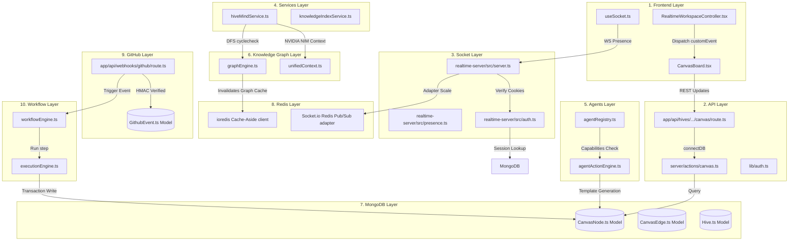

# HiveOS Visual Architecture Map

This document presents a structured reference model detailing the data flow, file locations, schemas, and processing loops within the HiveOS system.

---

## SECTION 1 — VERTICAL ARCHITECTURE STACK



---

## SECTION 2 — DETAILED LAYER BREAKDOWN

### 1. Frontend Layer
* **Files**:
  * [CanvasBoard.tsx](file:///c:/Users/mayan/HiveOS/hiveos-app/features/canvas/components/CanvasBoard.tsx): Parent board component for the React Flow coordinate render board.
  * [RealtimeWorkspaceController.tsx](file:///c:/Users/mayan/HiveOS/hiveos-app/features/realtime/components/RealtimeWorkspaceController.tsx): Dispatches custom events to trigger canvas re-syncs on connection state changes.
  * [useSocket.ts](file:///c:/Users/mayan/HiveOS/hiveos-app/features/realtime/hooks/useSocket.ts): Custom React hook that handles initialization and caching of the Socket.io client instance.
* **Core Functions**:
  * `handleResync(e)`: Invoked by CanvasBoard on event `canvas:resync`. Remaps raw node and edge configurations into React Flow schemas.
  * `resyncCanvasState()`: Fetches the latest canvas state from the REST API on network reconnection.
* **Events**: Dispatches `"canvas:resync"` to window; emits `"workspace:join"` to WebSocket channels.

### 2. API Layer
* **Files**:
  * `app/api/hives/[hiveId]/canvas/route.ts`: API endpoints managing workspace nodes, coordinate mutations, and edge creations.
  * [actions/canvas.ts](file:///c:/Users/mayan/HiveOS/hiveos-app/server/actions/canvas.ts): Server actions querying canvas vertices from MongoDB.
* **Core Functions**:
  * `GET(req, { params })`: Resolves session and returns canvas elements.
  * `POST(req, { params })`: Matches execution payload flags to perform canvas actions (`create_node`, `update_node`, `create_edge`, `delete_edge`).
  * `getCanvasElements(hiveId)`: Pulls canvas collections from database.

### 3. Socket Layer
* **Files**:
  * `realtime-server/src/server.ts`: The main entry point for the standalone Socket.io WS server.
  * `realtime-server/src/presence.ts`: Tracks real-time active workspace users and coordinates in Redis.
  * `realtime-server/src/auth.ts`: Cookie parser validating connection sessions against MongoDB collections.
* **Core Functions**:
  * `onConnection(socket)`: Connects client and hooks workspace event listeners.
  * `broadcastPresence(workspaceId)`: Scopes presence broadcasts to namespace rooms.
  * `validateSessionToken(token)`: Validates cookies on connection handshake.
* **WebSocket Events**:
  * Receives `"workspace:join"`, `"presence:update"`, `"cursor:move"`, `"typing:start"`.
  * Emits `"canvas:node-create"`, `"presence:list"`, `"chat:message"`.

### 4. Services Layer
* **Files**:
  * [hiveMindService.ts](file:///c:/Users/mayan/HiveOS/hiveos-app/server/utils/hiveMindService.ts): Runs cycle analysis, outputs recommendations, and calculates project metrics.
  * [knowledgeIndexService.ts](file:///c:/Users/mayan/HiveOS/hiveos-app/server/utils/knowledgeIndexService.ts): Syncs canvas modifications to search collections.
* **Core Functions**:
  * `detectCycles(nodes, edges)`: DFS implementation checking for loops.
  * `findCriticalPath(nodes, edges)`: Finds the longest scheduling chain in DAG configurations.
  * `indexNode(node)`: Normalizes nodes and adds them to text indexes.

### 5. Agents Layer
* **Files**:
  * [agentRegistry.ts](file:///c:/Users/mayan/HiveOS/hiveos-app/server/utils/agentRegistry.ts): Defines base capability matrices for agents.
  * [agentActionEngine.ts](file:///c:/Users/mayan/HiveOS/hiveos-app/server/utils/agentActionEngine.ts): Heuristic engine mapping diagnostic findings to action plans.
* **Core Functions**:
  * `buildAgentContext(hiveId)`: Generates text context summaries of workspace metrics.
  * `generateActionPlans(hiveId, findings)`: Maps diagnostics to step templates.
  * `computeActionQualityScore(...)`: Calculates quality metrics based on plan reversibility.

### 6. Knowledge Graph Layer
* **Files**:
  * [graphEngine.ts](file:///c:/Users/mayan/HiveOS/hiveos-app/server/utils/graphEngine.ts): Assembles adjacency lists from vertices and edges.
  * [unifiedContext.ts](file:///c:/Users/mayan/HiveOS/hiveos-app/server/utils/unifiedContext.ts): Aggregates workspace data (nodes, documents, activity history) for LLM consumption.
* **Core Functions**:
  * `buildGraph(hiveId)`: Queries elements and caches them in Redis.
  * `getProjectContext(hiveId)`: Compiles workspace states for model parsing.

### 7. MongoDB Layer (Database Models)
* **Files**:
  * `server/models/CanvasNode.ts`: Document schema representing visual items.
  * `server/models/CanvasEdge.ts`: Directed connection schema.
  * `server/models/Hive.ts`: Workspace settings schema.
  * `server/models/WorkflowRun.ts`: Stores step execution histories and logs.
* **Classes (Mongoose Models)**:
  * `CanvasNode`: Tracks coordinates, creators, categories, and titles.
  * `CanvasEdge`: Tracks target IDs, source IDs, and relation types.
  * `WorkflowRun`: Tracks proposed runs, step logs, and approval metadata.

### 8. Redis Layer
* **Files**:
  * [redis.ts](file:///c:/Users/mayan/HiveOS/hiveos-app/lib/redis.ts): Instantiates client connections.
* **Keys & Channels**:
  * Cache Key: `hiveos:graph:${hiveId}` (contains cached graphs, expires in 60s).
  * Channels: `hiveos:canvas` and `hiveos:activity` (used to broadcast cross-process notifications).

### 9. GitHub Layer
* **Files**:
  * `app/api/webhooks/github/route.ts`: Ingests webhook events from GitHub.
  * `server/models/GithubEvent.ts`: Stores webhook event details.
* **Core Functions**:
  * `POST(req)`: Validates signatures and saves webhook events.
  * `validateSignature(payload, signature, secret)`: Computes HMAC hashes to verify requests.

### 10. Workflow Layer
* **Files**:
  * [workflowEngine.ts](file:///c:/Users/mayan/HiveOS/hiveos-app/server/utils/workflowEngine.ts): Executes trigger evaluations and workflow step loops.
  * [executionEngine.ts](file:///c:/Users/mayan/HiveOS/hiveos-app/server/utils/executionEngine.ts): Executes approved plan steps inside transactional sessions.
* **Core Functions**:
  * `triggerWorkflowEvent(hiveId, triggerType, context)`: Evaluates triggers and spawns runs.
  * `executeActionPlan(hiveId, planId, actorId, ...)`: Runs steps (e.g. creating documents, nodes, or edges) inside database transactions.
  * `validateWorkflowHierarchy(...)`: Validates that workflow runs do not form recursive execution loops.

---

## SECTION 3 — CORE EVENT FLOWS

### 1. Canvas Modification Synchronization Flow
```
User drags node ──> [CanvasBoard.tsx] ──> emits API request (POST /canvas)
                                                        │
                                                        ▼
[Other Users] <── broadcasts ── [SocketServer] <── Redis Pub/Sub (hiveos:canvas)
```

### 2. Auto-Analysis Loop Flow
```
Graph modification ──> triggers REST api write ──> runAnalysisBackground()
                                                             │
                                                             ▼
Saved snapshots <── MongoDB write <── structured LLM <── LLaMA / NIM API
```

---
*End of Architecture Map.*
