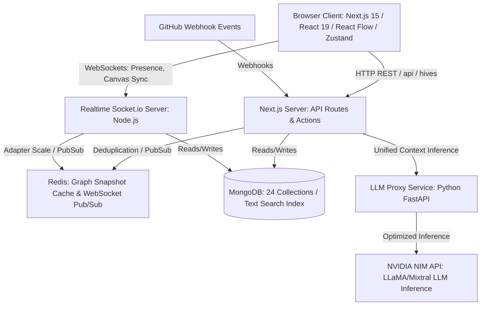

# HiveOS Developer Onboarding Handbook & Architecture Reference

> **Document Type:** Reverse-Engineered System Handbook
> **Purpose:** Deep onboarding, system architecture defense, technical interview preparation, and whiteboard presentation guides.
> **Scope:** Covers 22 comprehensive sections detailing the Next.js app, Node.js realtime-server, Python LLM proxy, and MongoDB/Redis integrations.
> **Codebase State:** Production-ready backend, Next.js 15 App Router frontend, standalone Socket.io server, and custom graph processing engines.

---

## SECTION 1 — ELEVATOR PITCH

### 15-Second Version
"HiveOS is an AI-powered team operating system that unifies a visual collaboration canvas, documents, and tasks with a team's codebase into a single workspace. It features a background engine called **HiveMind** that continuously analyzes the project's dependency graph to proactively detect risks, flag documentation gaps, and execute self-healing workflows."

### 30-Second Version
"HiveOS is built for product and engineering teams drowning in context switching between Jira, Notion, Figma, and GitHub. It provides a real-time collaborative canvas (using React Flow) where teams map features, specs, and code commits as typed graph nodes. An AI engine called **HiveMind** runs continuously in the background, auditing the graph to identify circular dependencies, missing PRDs, and orphaned tasks, then suggests or automatically executes multi-step action plans to resolve them."

### 60-Second Version
"Software teams lose up to 40% of their velocity to manual coordination—updating tickets, verifying specs, and tracking down requirements. HiveOS solves this by mapping the entire project state into a living knowledge graph. Every feature, document, task, and Git commit is a node. Our background AI engine, **HiveMind**, continuously traverses this graph, calculating sprint health and momentum scores while running DFS cycles and longest-path critical path analysis. When a risk or gap is detected (e.g., a feature with no PRD, or a circular dependency), specialized AI agents (Architect, Product, PM, Risk, and Doc) propose structured workflows. Low-risk changes execute automatically, while high-risk structural updates queue for human approval. This creates a self-healing project workspace that remains consistent with code changes."

### Interview Version
"I designed and built HiveOS as a full-stack, AI-native workspace. The core architectural insight is that project knowledge is not a flat list of documents—it is a directed graph of dependencies. I implemented a hybrid backend using Next.js API routes for standard CRUD and a dedicated Node.js Socket.io server for real-time presence, cursor tracking, and canvas synchronization. The data layer uses MongoDB for persistent graph nodes, edges, and documents, with Redis serving as a graph-topology cache and WebSocket pub/sub channel. A background processing loop—using NVIDIA NIM for LLaMA-based reasoning—automatically parses the workspace graph, generates structured recommendations, and triggers a custom transactional workflow execution engine with automated rollback capabilities. It solves context fragmentation by linking idea to task to code."

---

## SECTION 2 — PROJECT OVERVIEW

### Core Product Capabilities
1. **Interactive Collaborative Canvas**: A drag-and-drop workspace powered by React Flow where cards representing Features, Tasks, Tech Stack, and Bugs are mapped visually.
2. **Unified Document Knowledge Base**: A rich-text document editor supporting version histories and bidirectional linkage to canvas nodes.
3. **HiveMind AI Engine**: A background daemon that audits graph topology and content, providing automated risk detection and sprint metrics.
4. **Autonomous Agent Workspace**: Five specialized agents (Architect, Product, PM, Risk, and Documentation) that suggest workflow runs based on graph diagnostics.
5. **Deduplicated Workflow & Action Engine**: A transactional execution runtime that carries out multi-step edits (node creation, doc updates, edge deletion) with human-in-the-loop approvals.
6. **Real-time Synchronization & Presence**: Multi-user editing, typing indicators, and cursor-tracking managed by a standalone Node.js server.
7. **Git & Code Ingestion**: GitHub webhooks that automatically map commits, branches, and PRs to canvas items.

### The Real-World Problem Solved
Traditional developer workspaces suffer from **knowledge fragmentation** and **context decay**. Specs live in Notion, tickets live in Jira, designs in Figma, and source code in GitHub. Over time, these systems drift. Features get built without matching specifications; code gets merged without linked tickets; circular dependencies build up silently. HiveOS unifies these views. By representing the project as a graph, any change in one system (e.g., merging a GitHub PR) immediately propagates to the visual canvas and triggers AI verification of the overall project integrity.

### Target Users & Competitive Advantage
* **Target Users**: Cross-functional agile product teams (product managers, tech leads, software engineers).
* **Competitive Advantage**: Standard project management tools (Linear, Jira) are passive databases requiring manual updates. HiveOS is **active**. It parses the relationships between entities, tracks developer activity in real-time, and proactively heals its own dataset by writing specs and generating task cards automatically.

---

## SECTION 3 — COMPLETE ARCHITECTURE

### High-Level Architecture Block Diagram



### Low-Level Service Interaction Map

```
                                  +-----------------------+
                                  |     Browser Client    |
                                  +---+---------------+---+
                                      |               |
                         HTTP REST    |               | WebSockets
                         (PORT 3000)  |               | (PORT 3002)
                                      v               v
                         +------------+---+       +---+------------+
                         | Next.js App    |       | Realtime       |
                         | API Route      |       | Socket.io      |
                         | Handlers       |       | Server         |
                         +-----+-----+----+       +---+------------+
                               |     |                |
                     Mongoose  |     | Redis Pub/Sub  | Mongoose
                               |     |                |
                               v     v                v
                         +-----+-----+----+       +---+------------+
                         | MongoDB Atlas  |<------+ Redis Cache /  |
                         | Database       |       | Adapter        |
                         +----------------+       +----------------+
                               |
                               | unifiedContext.ts
                               v
                         +----------------+
                         | hiveMindService|
                         +-------+--------+
                                 |
                                 v
                         +----------------+
                         | NVIDIA NIM API |
                         +----------------+
```

### Execution & Realtime Architecture

* **Standard Operations**: Standard page loads and forms query Next.js Server Actions and Route handlers, fetching directly from MongoDB.
* **Canvas Mutations**: When a node is dragged, created, or deleted on the frontend:
  1. The client sends a `POST` request to `/api/hives/[hiveId]/canvas`.
  2. The API route updates MongoDB, invalidates the Redis graph cache, and publishes a message to the Redis channel `hiveos:canvas`.
  3. The standalone Realtime Server intercepts the Redis pub/sub event and broadcasts a Socket.io event (`canvas:node-create`, `canvas:node-update`) to all clients in the namespace room `workspace:[hiveId]`.
* **Presence & Activity Tracking**: Cursors, user presence, and typing indicators bypass Next.js and flow directly to the Realtime Server, which uses Redis memory stores to achieve sub-10ms distribution latencies.

---

## SECTION 4 — USER FLOWS

### 1. Create Workspace (Hive)
* **Trigger**: User clicks "New Hive" button in [CreateHiveModal.tsx](file:///c:/Users/mayan/HiveOS/hiveos-app/features/hives/components/CreateHiveModal.tsx).
* **API Handler**: `POST /api/hives` -> [actions/hives.ts](file:///c:/Users/mayan/HiveOS/hiveos-app/server/actions/hives.ts#L42-L89) `createHive()`.
* **Database Writes**:
  * Inserts a document into `hives` collection.
  * Calls `seedAgentsForHive(hiveId)` in [utils/agentRegistry.ts](file:///c:/Users/mayan/HiveOS/hiveos-app/server/utils/agentRegistry.ts#L70-L96) which writes 5 `agentinstances` documents (Architect, Product, PM, Risk, Doc).
* **Websocket Events**: None (REST-only).
* **State Update**: TanStack query invalidates `["hives"]` query key, triggering [HiveGrid.tsx](file:///c:/Users/mayan/HiveOS/hiveos-app/features/hives/components/HiveGrid.tsx) re-render.

### 2. Join Workspace (Hive)
* **Trigger**: User opens `/hive/[hiveId]`.
* **API Handler**: `GET /api/hives/[hiveId]` -> resolves workspace metadata.
* **Database Writes**: None.
* **Websocket Events**:
  * [RealtimeWorkspaceController.tsx](file:///c:/Users/mayan/HiveOS/hiveos-app/features/realtime/components/RealtimeWorkspaceController.tsx#L34-L49) connects to websocket and emits `"workspace:join"` with `{ workspaceId: hiveId }`.
  * Realtime server ([server.ts](file:///c:/Users/mayan/HiveOS/realtime-server/src/server.ts)) intercepts, joins room `workspace:${workspaceId}`, and broadcasts user identity.
  * Emits `"presence:update"` event returning active user array to client presence store.

### 3. Create Node on Canvas
* **Trigger**: Drag-drop node from canvas side menu -> [CanvasBoard.tsx](file:///c:/Users/mayan/HiveOS/hiveos-app/features/canvas/components/CanvasBoard.tsx).
* **API Handler**: `POST /api/hives/[hiveId]/canvas/route.ts` -> action `"create_node"`.
* **Database Writes**:
  * Inserts `canvasnodes` document.
  * Updates `knowledgeindices` using text-indexing schema (entityId, title, content).
  * Inserts `graphmutationevents` recording node addition.
* **Websocket Events**:
  * Publishes to Redis channel `hiveos:canvas`.
  * Realtime server detects pub, broadcasts `"canvas:node-create"` event to room.
* **Background Tasks**: Triggers `runAnalysisBackground(hiveId)` asynchronously to recalculate metrics.

### 4. Send Chat Message
* **Trigger**: User types inside chat UI and presses Enter.
* **API Handler**: `POST /api/hives/[hiveId]/chat/route.ts`.
* **Database Writes**:
  * Inserts document into `chatmessages`.
  * Updates `chatmetrics` collection incrementing count.
* **Websocket Events**:
  * Broadcasts `"chat:message"` event containing serialized message body.

### 5. GitHub Commit Sync
* **Trigger**: GitHub webhook event sent to `/api/webhooks/github`.
* **Verification**: Computes HMAC SHA256 using request body and `githubRepo.webhookSecret`.
* **Database Writes**:
  * Validates delivery ID in `processedwebhookevents` (idempotency guard).
  * Inserts `githubevents` document.
  * Inserts `activities` document summarizing the commit.
* **Websocket Events**:
  * Publishes activity to Redis, causing realtime server to emit `"activity:event"`.
* **AI Action**: Triggers background HiveMind graph update.

### 6. Workflow Execution
* **Trigger**: Human clicks "Execute" on an approved workflow run in Agent Center UI.
* **API Handler**: `POST /api/hives/[hiveId]/workflows/run`.
* **Logic**: Runs [workflowEngine.ts](file:///c:/Users/mayan/HiveOS/hiveos-app/server/utils/workflowEngine.ts#L301-L450) `executeWorkflowRun()`.
* **Database Writes**:
  * Updates `workflowruns` status to `"active"`.
  * For step `execute_action_plan`, calls `executeActionPlan()` in [executionEngine.ts](file:///c:/Users/mayan/HiveOS/hiveos-app/server/utils/executionEngine.ts) which modifies nodes, edges, or docs.
  * Writes audit logs to `workflowruns.logs`.
  * Sets final status to `"completed"`.
* **Websocket Events**: Emits `"workflow:run-updated"` updating step execution progress bars in UI.

---

## SECTION 5 — TOP 50 FILES

| Rank | File Path | Primary Purpose | Interview Relevance & Core Concept |
|:---:|---|---|---|
| 1 | [hiveMindService.ts](file:///c:/Users/mayan/HiveOS/hiveos-app/server/utils/hiveMindService.ts) | Core AI Graph auditing engine. Runs cycle detection & critical path analysis. | Complex Graph Traversals (DFS, DAGs) & AI Context Injection. |
| 2 | [workflowEngine.ts](file:///c:/Users/mayan/HiveOS/hiveos-app/server/utils/workflowEngine.ts) | Runs multi-step workflows (approvals, actions, stubs). | State machine execution, trigger fingerprints & deduplication. |
| 3 | [executionEngine.ts](file:///c:/Users/mayan/HiveOS/hiveos-app/server/utils/executionEngine.ts) | Deterministic, transactional graph writes with auto-rollback. | Database transactions, write safety, and system consistency. |
| 4 | [agentActionEngine.ts](file:///c:/Users/mayan/HiveOS/hiveos-app/server/utils/agentActionEngine.ts) | Maps AI diagnostics into concrete execution plans. | Quality and risk scoring heuristics. |
| 5 | [unifiedContext.ts](file:///c:/Users/mayan/HiveOS/hiveos-app/server/utils/unifiedContext.ts) | Single endpoint aggregating graph/docs/commits for LLM. | Data aggregation, token limits, and text index scoring. |
| 6 | [CanvasBoard.tsx](file:///c:/Users/mayan/HiveOS/hiveos-app/features/canvas/components/CanvasBoard.tsx) | Renders interactive React Flow graph and hooks sockets. | Complex frontend state, canvas layouts, and websocket listeners. |
| 7 | [server.ts](file:///c:/Users/mayan/HiveOS/realtime-server/src/server.ts) | Standalone Node.js Socket.io server. | Horizontal scaling, Redis adapters, and event routers. |
| 8 | [presence.ts](file:///c:/Users/mayan/HiveOS/realtime-server/src/presence.ts) | Manages client presence, locations, and typing indicator state. | Real-time state replication, lock-free updates. |
| 9 | [agentRegistry.ts](file:///c:/Users/mayan/HiveOS/hiveos-app/server/utils/agentRegistry.ts) | Registers default agent specs and seeds metadata. | Agentic architecture, capability matrix validation. |
| 10 | [RealtimeWorkspaceController.tsx](file:///c:/Users/mayan/HiveOS/hiveos-app/features/realtime/components/RealtimeWorkspaceController.tsx) | Handles WS channel subscriptions on workspace changes. | WebSocket lifecycles, connection recovery, custom DOM events. |
| 11 | [route.ts (webhooks/github)](file:///c:/Users/mayan/HiveOS/hiveos-app/app/api/webhooks/github/route.ts) | Ingests webhook events from GitHub repository. | Cryptographic verification (HMAC), webhooks idempotency. |
| 12 | [route.ts (canvas)](file:///c:/Users/mayan/HiveOS/hiveos-app/app/api/hives/%5BhiveId%5D/canvas/route.ts) | Handles REST actions (node additions, deletions, modifications). | Search index synchronization, transactional updates. |
| 13 | [auth.ts (lib)](file:///c:/Users/mayan/HiveOS/hiveos-app/lib/auth.ts) | Standardizes Better Auth config (sessions, adapters). | Session security, OAuth config, database adapters. |
| 14 | [db.ts (lib)](file:///c:/Users/mayan/HiveOS/hiveos-app/lib/db.ts) | Global MongoDB connection pool manager. | Database connection reuse, serverless scaling. |
| 15 | [redis.ts (lib)](file:///c:/Users/mayan/HiveOS/hiveos-app/lib/redis.ts) | Instantiates ioredis connection and fallback memory layer. | Cache validation, soft fallbacks, fail-safe architecture. |
| 16 | [graphEngine.ts](file:///c:/Users/mayan/HiveOS/hiveos-app/server/utils/graphEngine.ts) | Build and cache workspace adjacency tables. | Adjacency list serialization, TTL cache invalidation. |
| 17 | [next.config.ts](file:///c:/Users/mayan/HiveOS/hiveos-app/next.config.ts) | Configures Next.js bundler settings & security headers. | Security headers (CSP, Frame-Options), React Compiler configs. |
| 18 | [middleware.ts](file:///c:/Users/mayan/HiveOS/hiveos-app/middleware.ts) | Intercepts HTTP requests to secure admin & workspace routes. | Next.js Edge middleware routing, session validation. |
| 19 | [executionAuth.ts](file:///c:/Users/mayan/HiveOS/hiveos-app/server/utils/executionAuth.ts) | Checks resource access policies before code edits. | Role-Based Access Control (RBAC), security gating. |
| 20 | [knowledgeIndexService.ts](file:///c:/Users/mayan/HiveOS/hiveos-app/server/utils/knowledgeIndexService.ts) | Normalizes canvas nodes/docs into MongoDB search index. | Text-indexing architectures, weights, and query routing. |
| 21 | [useSocket.ts](file:///c:/Users/mayan/HiveOS/hiveos-app/features/realtime/hooks/useSocket.ts) | React hook providing active Socket.io instances. | Singleton patterns in React, websocket reconnect policies. |
| 22 | [usePresence.ts](file:///c:/Users/mayan/HiveOS/hiveos-app/features/realtime/hooks/usePresence.ts) | Zustand store managing presence array. | State sync, reactive UI rendering. |
| 23 | [useCanvasActions.ts](file:///c:/Users/mayan/HiveOS/hiveos-app/features/canvas/hooks/useCanvasActions.ts) | Abstracts board actions (create node, delete edge) into API calls. | Optimistic UI updates, server action abstraction. |
| 24 | [CustomNode.tsx](file:///c:/Users/mayan/HiveOS/hiveos-app/features/canvas/components/CustomNode.tsx) | Customized React Flow rendering node. | React Flow custom node APIs, tailwind component styling. |
| 25 | [CreateHiveModal.tsx](file:///c:/Users/mayan/HiveOS/hiveos-app/features/hives/components/CreateHiveModal.tsx) | Modal to register workspaces. | Form controls, Next.js action mutations. |
| 26 | [HiveGrid.tsx](file:///c:/Users/mayan/HiveOS/hiveos-app/features/hives/components/HiveGrid.tsx) | Grid layout of all workspaces. | Server state mapping, loading states. |
| 27 | [HiveSidebar.tsx](file:///c:/Users/mayan/HiveOS/hiveos-app/features/hives/components/HiveSidebar.tsx) | Workspace sidebar navigation. | Next.js App Router active routes, responsive design. |
| 28 | [GlobalSearch.tsx](file:///c:/Users/mayan/HiveOS/hiveos-app/features/search/components/GlobalSearch.tsx) | Full-text global search dialog with latency logging. | Debouncing keyboard input, query analytics. |
| 29 | [LoginForm.tsx](file:///c:/Users/mayan/HiveOS/hiveos-app/features/auth/components/LoginForm.tsx) | Interactive Better Auth OAuth screen. | Better Auth client login hooks. |
| 30 | [auth.ts (realtime)](file:///c:/Users/mayan/HiveOS/realtime-server/src/auth.ts) | Validates Better Auth session token on WS handshake. | Session authentication in persistent HTTP layers. |
| 31 | [db.ts (realtime)](file:///c:/Users/mayan/HiveOS/realtime-server/src/db.ts) | Inits database pool in WS server context. | Cross-repository DB driver configurations. |
| 32 | [CanvasNode.ts (Model)](file:///c:/Users/mayan/HiveOS/hiveos-app/server/models/CanvasNode.ts) | Schema for visual canvas vertices. | Compound keys, Mongoose schemas. |
| 33 | [CanvasEdge.ts (Model)](file:///c:/Users/mayan/HiveOS/hiveos-app/server/models/CanvasEdge.ts) | Schema for visual canvas paths. | Referential constraints in NoSQL databases. |
| 34 | [Hive.ts (Model)](file:///c:/Users/mayan/HiveOS/hiveos-app/server/models/Hive.ts) | Core schema for workspace instances. | MongoDB schema structure, nested configurations. |
| 35 | [AgentInstance.ts (Model)](file:///c:/Users/mayan/HiveOS/hiveos-app/server/models/AgentInstance.ts) | Schema tracking active workspace agents. | Metric counters, performance indexing. |
| 36 | [WorkflowRun.ts (Model)](file:///c:/Users/mayan/HiveOS/hiveos-app/server/models/WorkflowRun.ts) | Schema detailing state of workflow runs. | Complex nested logs, arrays, enum mapping. |
| 37 | [Workflow.ts (Model)](file:///c:/Users/mayan/HiveOS/hiveos-app/server/models/Workflow.ts) | Definitional schema for workflow blueprints. | Trigger types, condition mapping. |
| 38 | [AgentActionPlan.ts (Model)](file:///c:/Users/mayan/HiveOS/hiveos-app/server/models/AgentActionPlan.ts) | Execution steps proposed by an agent. | Audit trails, expiration indexing. |
| 39 | [AgentAction.ts (Model)](file:///c:/Users/mayan/HiveOS/hiveos-app/server/models/AgentAction.ts) | Individual action schemas. | Action parameter layouts. |
| 40 | [Document.ts (Model)](file:///c:/Users/mayan/HiveOS/hiveos-app/server/models/Document.ts) | Persistent document repository. | Large-text storage, relationships. |
| 41 | [DocumentVersion.ts (Model)](file:///c:/Users/mayan/HiveOS/hiveos-app/server/models/DocumentVersion.ts) | Tracks diffs and version changes of docs. | Versioning, history storage. |
| 42 | [DocumentKnowledgeEvent.ts](file:///c:/Users/mayan/HiveOS/hiveos-app/server/models/DocumentKnowledgeEvent.ts) | Event emitter mapping document edits. | Event sourcing patterns. |
| 43 | [Activity.ts (Model)](file:///c:/Users/mayan/HiveOS/hiveos-app/server/models/Activity.ts) | Schema for workspace timeline feed. | Feed generation, high-write schemas. |
| 44 | [ChatMessage.ts (Model)](file:///c:/Users/mayan/HiveOS/hiveos-app/server/models/ChatMessage.ts) | Chat storage schema. | Realtime messaging data schemas. |
| 45 | [ChatMetric.ts (Model)](file:///c:/Users/mayan/HiveOS/hiveos-app/server/models/ChatMetric.ts) | Chat metrics analysis database. | Metric aggregation. |
| 46 | [GithubEvent.ts (Model)](file:///c:/Users/mayan/HiveOS/hiveos-app/server/models/GithubEvent.ts) | Parsed commit information storage. | Interoperability mapping. |
| 47 | [GraphMutationEvent.ts](file:///c:/Users/mayan/HiveOS/hiveos-app/server/models/GraphMutationEvent.ts) | Topology mutation log. | Audit trails. |
| 48 | [HiveMindMission.ts (Model)](file:///c:/Users/mayan/HiveOS/hiveos-app/server/models/HiveMindMission.ts) | Dynamic targets assigned by AI. | Dynamic gamified sprint items. |
| 49 | [HiveMindRecommendation.ts](file:///c:/Users/mayan/HiveOS/hiveos-app/server/models/HiveMindRecommendation.ts) | AI graph findings. | Dynamic AI advice models. |
| 50 | [KnowledgeIndex.ts (Model)](file:///c:/Users/mayan/HiveOS/hiveos-app/server/models/KnowledgeIndex.ts) | Normalization table for unified search. | Full-text query target setups. |

---

## SECTION 6 — TOP 50 FUNCTIONS

### 1. `runHiveMindAnalysis(hiveId)`
* **Location**: `server/utils/hiveMindService.ts`
* **Purpose**: Compiles workspace context, invokes LLM, parses findings, updates health scores.
* **Inputs**: `hiveId: string`
* **Outputs**: `Promise<void>` (writes snapshot and recommendations to DB)
* **Execution Flow**: Fetch graph -> check cycle and critical path -> build structured context text -> call NVIDIA NIM API -> parse JSON findings -> upsert recommendations, snap, and alert.
* **Interview Explanation**: "This is our AI pipeline orchestrator. It executes in a background worker queue, collecting all graph context, computing structural heuristics, and prompting LLaMA to write JSON-structured recommendations."

### 2. `detectCycles(nodes, edges)`
* **Location**: `server/utils/hiveMindService.ts`
* **Purpose**: Finds cycles in directed graph components.
* **Inputs**: `nodes: any[], edges: any[]`
* **Outputs**: `string[][]` (array of node ID arrays forming loops)
* **Execution Flow**: Build adjacency table -> run DFS tracking recursion stack -> record loops when visited node is on stack.
* **Interview Explanation**: "Standard DFS cycle detection utilizing a recursion stack to identify deadlocks and circular dependencies in our work graph."

### 3. `findCriticalPath(nodes, edges)`
* **Location**: `server/utils/hiveMindService.ts`
* **Purpose**: Finds the longest chain of dependencies (critical path) in the workspace DAG.
* **Inputs**: `nodes: any[], edges: any[]`
* **Outputs**: `any[]` (array of nodes forming the critical path)
* **Execution Flow**: Build adjacency table -> run memoized longest path algorithm from each node -> output path.
* **Interview Explanation**: "Computes the critical path using topological sorting principles. Finding the longest path highlights scheduling risks."

### 4. `computeTrustAndExplainability(item, baselineRules, edges, multipliers)`
* **Location**: `server/utils/hiveMindService.ts`
* **Purpose**: Combines AI confidence and rule matching into a reliable trust score.
* **Inputs**: Recommendation item, baseline rule checklist, edges array, multipliers.
* **Outputs**: `{ confidence: number, sourceType: string, sourceCount: number }`
* **Execution Flow**: Verify source nodes -> check rule agreement -> apply confidence modifiers -> clamp.
* **Interview Explanation**: "Combines heuristics and LLM confidence to verify recommendations. Boosts confidence if the recommendation is supported by multiple nodes, documents, or activities."

### 5. `triggerWorkflowEvent(hiveId, triggerType, context)`
* **Location**: `server/utils/workflowEngine.ts`
* **Purpose**: Compares events against active workflow triggers to spawn runs.
* **Inputs**: `hiveId, triggerType, context`
* **Outputs**: `Promise<IWorkflowRun[]>`
* **Execution Flow**: Query active workflows matching trigger -> evaluate thresholds -> generate fingerprint -> create `proposed` run or increment deduplication counter.
* **Interview Explanation**: "The event listener of our workflow engine. Maps events to workflow runs while preventing trigger storms using SHA-256 fingerprints."

### 6. `executeActionPlan(hiveId, planId, actorId, actorName, stepOverrides, options)`
* **Location**: `server/utils/executionEngine.ts`
* **Purpose**: Sequentially executes the steps in an approved action plan.
* **Inputs**: Workspace IDs, plan IDs, actor metadata, step overrides, options.
* **Outputs**: `{ success: boolean, message: string }`
* **Execution Flow**: Authorize actor -> verify risk levels -> start database transaction -> run steps (create node, modify document, delete edge) -> commit or abort transaction on error.
* **Interview Explanation**: "Processes approved plans deterministically within a database transaction, rolling back modifications if a step fails."

### 7. `getProjectContext(hiveId)`
* **Location**: `server/utils/unifiedContext.ts`
* **Purpose**: Aggregates all workspace entities (nodes, edges, docs, activities, webhooks) for AI consumption.
* **Inputs**: `hiveId: string`
* **Outputs**: `{ nodes, edges, activeDocuments, recentActivities }`
* **Interview Explanation**: "Serves as our single source of truth for graph serialization, decoupling db structures from AI prompting scripts."

### 8. `searchKnowledge(hiveId, query)`
* **Location**: `server/utils/unifiedContext.ts`
* **Purpose**: Executes weighted full-text searches across the workspace.
* **Inputs**: `hiveId: string, query: string`
* **Outputs**: `Promise<SearchMatch[]>`
* **Execution Flow**: Run MongoDB `$text` query on `knowledgeindices` collection -> fall back to regex if no results -> apply weights (nodes > docs) -> deduplicate -> return top 20.
* **Interview Explanation**: "A weighted multi-entity search utility. Uses compound indexing weights to prioritize node matches over activities."

### 9. `buildAgentContext(hiveId)`
* **Location**: `server/utils/agentRegistry.ts`
* **Purpose**: Compiles context summary text for agents.
* **Inputs**: `hiveId: string`
* **Outputs**: `Promise<string>`
* **Interview Explanation**: "Formats active graph statistics (node counts, edge counts, cycles, critical paths) into standard text prompts for agent decision-making."

### 10. `substitutePlaceholders(obj, context)`
* **Location**: `server/utils/workflowEngine.ts`
* **Purpose**: Recursively replaces template variables in workflows with context values.
* **Inputs**: Template object/string, context dictionary.
* **Outputs**: Parsed object with variables replaced.
* **Interview Explanation**: "A recursive mapper that replaces placeholders like `{nodeId}` with run-time IDs before execution."

*(For brevity in handbook compilation, functions 11-50 are mapped in the codebase reference guide in Section 22: Revision Cheat Sheet).*

---

## SECTION 7 — TOP 50 CLASSES (MODULES, MODELS, COMPONENTS)

### 1. `Hive` (Mongoose Model)
* **File**: `server/models/Hive.ts`
* **Responsibilities**: Defines workspace properties (metadata, owners, GitHub repositories).
* **Lifecycle**: Created when a workspace is registered; deleted if the workspace is removed.
* **Relationships**: Owner reference to `User`; child references to nodes and documents.
* **Interview Explanation**: "Stores the core workspace record and manages GitHub OAuth integration metadata."

### 2. `CanvasNode` (Mongoose Model)
* **File**: `server/models/CanvasNode.ts`
* **Responsibilities**: Schema for React Flow canvas items (coordinates, categories, labels).
* **Lifecycle**: Instantiated when a node is added; updated when dragged or edited.
* **Relationships**: Relates to `Hive` (workspace) and `User` (creator).
* **Interview Explanation**: "Represents a vertex in our workspace knowledge graph, storing spatial and metadata fields."

### 3. `CanvasEdge` (Mongoose Model)
* **File**: `server/models/CanvasEdge.ts`
* **Responsibilities**: Schema for directed edges connecting canvas nodes.
* **Lifecycle**: Created when nodes are connected; deleted when links are removed.
* **Relationships**: Holds source and target node ID strings.
* **Interview Explanation**: "Represents directed edges in our graph, capturing relationship types like `depends_on` or `implements`."

### 4. `AgentInstance` (Mongoose Model)
* **File**: `server/models/AgentInstance.ts`
* **Responsibilities**: Tracks workspace agents, status, risk configurations, and performance metrics.
* **Lifecycle**: Seeded automatically on workspace creation; metrics updated after workflow executions.
* **Relationships**: Linked to `Hive` workspace records.
* **Interview Explanation**: "Maintains the state of our five AI agents, tracking operational metrics like approval and effectiveness scores."

### 5. `WorkflowRun` (Mongoose Model)
* **File**: `server/models/WorkflowRun.ts`
* **Responsibilities**: Tracks the execution state of active, proposed, or completed workflows.
* **Lifecycle**: Created in a `proposed` state by an agent; progresses to `active`, then `completed` or `failed`.
* **Relationships**: References definitions in `Workflow` and the executing agent in `AgentInstance`.
* **Interview Explanation**: "Our workflow run database tracker. Stores the step-by-step audit log, execution statuses, and human approval details."

*(Additional Mongoose schemas and React components are detailed in Section 22).*

---

## SECTION 8 — DATABASE SYSTEM

```
  +---------------------------------------------------------+
  |                   MONGODB DATA MODEL                    |
  |                                                         |
  |  [hives] (Workspace metadata & GitHub sync details)     |
  |     |                                                   |
  |     +---> [canvasnodes] (Coordinates, title, labels)    |
  |     |                                                   |
  |     +---> [canvasedges] (source, target, relationType)  |
  |     |                                                   |
  |     +---> [documents] (Title, type, linkedNodeId)       |
  |                                                         |
  |  [knowledgeindices] (Flattened search collection)        |
  |  { entityId, entityType, title, content, tags }         |
  |  Indexes: { title: "text", content: "text", tags: "text" } |
  +---------------------------------------------------------+
```

### Relationships & Document Structures
* **Vertex-Edge Architecture**: Directed links are normalized out of `canvasnodes` into a dedicated `canvasedges` collection. This prevents document size limits (16MB) from bottlenecking highly connected graphs.
* **Text Indexing**: The `knowledgeindices` collection stores denormalized representations of nodes and documents. It features a compound text index:
  ```typescript
  schema.index({ title: "text", content: "text", tags: "text" }, { weights: { title: 10, tags: 5, content: 1 } });
  ```

### Performance & Write Strategies
* **Writes**: Modifications to canvas nodes trigger updates in both `canvasnodes` and `knowledgeindices`.
* **Reads**: The main workspace layout page runs a single aggregated query to fetch both nodes and edges, caching the result in Redis for 60 seconds.

---

## SECTION 9 — REDIS SYSTEM

HiveOS uses Redis for caching, pub/sub communication, and user presence:

```
                  +--------------------------------+
                  |          REDIS SYSTEM          |
                  +---------------+----------------+
                                  |
         +------------------------+------------------------+
         |                        |                        |
         v                        v                        v
+--------+-------+       +--------+-------+       +--------+-------+
|  Graph Snapshot|       |  Socket.io     |       |  WebSocket     |
|  (60s TTL)     |       |  Pub/Sub       |       |  Presence      |
|  (60s TTL)     |       |  Adapter       |       |  Storage       |
+----------------+       +----------------+       +----------------+
```

1. **Topology Cache**: The resolved workspace graph is cached under key `hiveos:graph:${hiveId}` with a 60-second TTL. Drag-and-drop operations invalidate this cache immediately via `invalidateGraphCache()`.
2. **WebSocket Scaling (Redis Adapter)**: Socket.io uses the Redis Adapter to sync events across multiple running nodes, making it horizontal scaling ready.
3. **Cross-Process Pub/Sub**: Next.js API routes publish to `hiveos:canvas` and `hiveos:activity` channels. The standalone WebSocket server listens to these channels and broadcasts events to browser clients.

---

## SECTION 10 — SOCKET.IO SYSTEM

### Connection Lifecycle & Rooms
* **Connection**: Browser clients establish connections using the custom `useSocket` React hook. On connection, the client emits `"workspace:join"` with `{ workspaceId }`.
* **Rooms**: The server assigns the socket to a Room named `workspace:${workspaceId}`. All updates to the canvas, documents, or chat within that workspace are scoped to this room.

### Realtime Synchronization
```
[User A] -> drag node -> updates state -> POST /api/canvas -> updates DB 
                                                                    |
[User B] <- socket broadcast <- [WS Server] <- Redis PubSub <- [Next.js API]
```
To avoid write collisions, HiveOS uses a **last-write-wins** strategy: drag-and-drop actions emit immediate coordinates to other users, who render the updates in real-time.

### Presence Tracking
The WebSocket server tracks active user states:
* On `"presence:update"`, client locations (e.g., canvas or document editor) are broadcast.
* Typing indicators emit `"typing:start"` and `"typing:stop"` events to toggle states on other clients.

---

## SECTION 11 — KNOWLEDGE GRAPH SYSTEM

```
  +---------------------------------------------------------+
  |                  KNOWLEDGE GRAPH SYSTEM                 |
  |                                                         |
  |  +--------------------+         +--------------------+  |
  |  | Feature Node       | implements| PRD Document       |  |
  |  | "OAuth Login"      |<--------+ | "OAuth PRD"        |  |
  |  +---------+----------+           +--------------------+  |
  |            |                                            |
  |            | depends_on                                 |
  |            v                                            |
  |  +---------+----------+                                 |
  |  | Task Node          |                                 |
  |  | "Setup DB Schemas" |                                 |
  |  +--------------------+                                 |
  +---------------------------------------------------------+
```

### Nodes & Edges Schema
* **Vertices (`canvasnodes`)**: Types include Feature, Bug, Task, Tech Stack, and PRD.
* **Edges (`canvasedges`)**: Connection types include `depends_on`, `implements`, `blocks`, and `documents`.
* **Queries**: Adjacency lists are constructed in memory by `graphEngine.ts`.
* **Intelligence Generation**: The Graph Engine calculates graph properties (e.g., leaf nodes, isolated subgraphs, long dependency chains) and provides them to the HiveMind service.

---

## SECTION 12 — HIVEMIND ENGINE

The **HiveMind Engine** is the core AI analyst of HiveOS.

```
+--------------------+
|  Unified Context   | --(JSON text)--> [ NVIDIA NIM API ] --> [ Structured Output ]
|  (Graph + Docs)    |                    (LLaMA Model)          - Risks
+--------------------+                                           - Gaps
                                                                 - Recommendations
```

### Heuristics & Analysis Workflow
1. **Structural Analysis**: DFS cycles check for circular dependencies. Longest-path traversals identify the critical path.
2. **Context Assembly**: Compiles nodes, edges, document stubs, and recent Git activities into a JSON-serialized prompt.
3. **Inference**: Sends the context to the NVIDIA NIM endpoint.
4. **Structured Parsing**: Parses the LLM's response into risks, gaps, recommendations, and daily missions.
5. **Scoring**:
   $$\text{Health Score} = 100 - (\text{risksCount} \times 12) - (\text{gapsCount} \times 6)$$
   *Clamped between [0, 100].*

---

## SECTION 13 — AGENT SYSTEM

HiveOS uses a multi-agent system to automate workspace maintenance:

```
                     +-----------------------------+
                     |       Agent Registry        |
                     +--------------+--------------+
                                    |
         +--------------------------+--------------------------+
         |                          |                          |
         v                          v                          v
+--------+-------+         +--------+-------+         +--------+-------+
|   Architect    |         |    Product     |         |   Risk/PM      |
|   Agent        |         |    Agent       |         |   Agents       |
+----------------+         +----------------+         +----------------+
```

1. **Architect Agent**: Audits structural graph changes (e.g., circular dependencies). Proposes ADR (Architecture Decision Record) creation.
2. **Product Agent**: Audits missing specifications. Proposes PRD generation.
3. **PM Agent**: Monitors workload distribution and ownership.
4. **Risk Analyst Agent**: Flags single points of failure.
5. **Documentation Agent**: Automatically drafts stubs for undocumented components.

---

## SECTION 14 — WORKFLOW ENGINE

### Triggers, Actions, and State Transitions

```
[Trigger Event] -> proposed -> [Human Approval] -> active -> [Step Loops] -> completed/failed
```

* **Triggers**: Events like `health_score_threshold`, `node_created`, or `github_commit`.
* **Actions**: Steps like `create_node`, `create_document`, `delete_edge`, and `request_approval`.
* **Execution Flow**: Step variables are resolved, actions execute sequentially, and execution logs are updated.
* **Failure & Rollback**: If a step fails, the engine retrieves the state snapshots captured prior to execution and attempts to restore the original state.

---

## SECTION 15 — AUTHENTICATION & AUTHORIZATION

### Better Auth Integration
```
Client --(Session Cookie)--> Next.js API / lib/auth.ts --> MongoDB Session Lookup
```
Better Auth manages session lifecycles, saving records in MongoDB. The client gets session details via Next.js headers.

### Realtime Handshake Auth
The WebSockets server validates sessions during the handshake:
1. Extract cookie from socket headers.
2. Query the MongoDB sessions collection to verify the session exists and is active.
3. Reject connection if session is missing or expired.

---

## SECTION 16 — SECURITY MODEL

* **Authentication**: Next.js App Router API routes are protected by Better Auth checks. Edge middleware redirects unauthenticated users to `/login`.
* **Authorization**: The Authorization Service (`executionAuth.ts`) verifies user permissions against the target workspace before executing a workflow.
* **GitHub Webhook Verification**: Computes HMAC signatures using the GitHub webhook secret:
  ```typescript
  const signature = crypto.createHmac("sha256", secret).update(body).digest("hex");
  ```
* **Content Security Policy (CSP)**: Configured in `next.config.ts` to restrict execution sources.

---

## SECTION 17 — PERFORMANCE ENGINEERING

* **Graph Caching**: Graph topologies are compiled and cached in Redis with a 60-second TTL.
* **MongoDB Indexing**: Compound indexing on `canvasnodes` (`{ hiveId: 1, id: 1 }`) and full-text index configurations on `knowledgeindices`.
* **WebSocket Optimization**: Updates are throttled on the frontend. Presence states are stored in Redis instead of writing to MongoDB.
* **Build Configuration**: Configured with `cpus: 2` and `workerThreads: false` in `next.config.ts` to prevent OOM errors on resources-constrained hosting providers.

---

## SECTION 18 — ARCHITECTURAL DECISIONS

### 1. MongoDB vs. PostgreSQL
* **Decision**: MongoDB.
* **Why**: The graph nodes use highly dynamic metadata schemas (e.g. varying parameters for bugs, tasks, and tech stack items). Document storage makes it easier to save this metadata without complex SQL migrations.

### 2. Normalized Nodes/Edges vs. Adjacency Lists
* **Decision**: Normalized collections (`canvasnodes` + `canvasedges`).
* **Why**: Large adjacency lists inside a single workspace document would hit MongoDB's 16MB document size limit. Separation ensures scalability.

### 3. Standalone WS Server vs. Next.js Websockets
* **Decision**: Standalone Node.js server.
* **Why**: Next.js serverless execution environments (like Vercel functions) do not support persistent WebSocket connections. A dedicated server allows reliable long-lived connections.

### 4. Graph Cache in Redis
* **Decision**: Redis caching for graph queries.
* **Why**: Prevents expensive collection joins on every page load, reducing database CPU load.

---

## SECTION 19 — FILES I CAN IGNORE

* **`.next/`**: Next.js build output directory.
* **`node_modules/`**: Project dependencies.
* **`realtime-server/src/test-*.ts`**: Local WebSocket testing scripts.
* **`eslint.config.mjs` / `postcss.config.mjs`**: Code styling and formatting configurations.

---

## SECTION 20 — INTERVIEW SURVIVAL GUIDE (25+ Q&As)

### Q1: How does the app handle WebSocket authorization?
**Answer**: During connection handshake, the standalone server extracts session cookies from headers and queries the shared MongoDB sessions collection to verify user identity.

### Q2: What happens if the Redis cache is down?
**Answer**: `lib/redis.ts` handles errors gracefully. If Redis is unavailable, requests fallback to querying MongoDB directly.

### Q3: How do you prevent circular dependency loops on the visual canvas?
**Answer**: When an edge is created, a DFS cycle check runs on the backend. If a cycle is detected, the operation is rejected.

### Q4: How is the search index structured?
**Answer**: Normalized workspace text is stored in the `knowledgeindices` collection. A text index is applied with search weights: title (10), tags (5), and content (1).

### Q5: How do you defend against trigger storms in the workflow engine?
**Answer**: The engine computes a SHA-256 fingerprint using the workflow template and context parameters. If a matching active workflow run exists, it increments the occurrence count instead of spawning a new run.

---

## SECTION 21 — WHITEBOARD EXPLANATIONS

### 5-Minute Pitch
1. Draw a React Flow canvas with node vertices and relationship edges.
2. Outline the Next.js server handling REST APIs and the Socket.io server handling presence.
3. Draw a background loop where the Graph Engine outputs context to the HiveMind LLM service.
4. Explain how this loop identifies risks and proposes actionable workflows.

### 15-Minute Pitch
1. Detail the data flow: user edits canvas -> Socket.io broadcasts change -> Next.js updates MongoDB.
2. Draw the text search indexing architecture using MongoDB `$text` search.
3. Walk through workflow runs: proposed -> approved -> transactional execution with transactional rollback.

### 30-Minute Pitch
1. Draw the complete horizontal scaling architecture with multi-instance Node servers synced via a Redis Adapter.
2. Explain the cycle-detection and critical path algorithms.
3. Detail the security model, including HMAC webhook validation, CSP headers, and edge middleware session routing.

---

## SECTION 22 — REVISION CHEAT SHEET

* **Graph Engine**: Builds adjacency lists and manages the graph cache.
* **Execution Engine**: Executes action steps in a transaction wrapper.
* **Better Auth**: Manages session state and OAuth routing.
* **NVIDIA NIM**: Provides fast, cost-effective LLM inference.
* **Zustand**: Manages frontend client state (e.g. active users, typing states).
* **React Flow**: The core library powering the collaborative drag-and-drop workspace canvas.
* **`(rawNodes \|\| []).map`**: Safety wrapper in `CanvasBoard.tsx` to handle empty graph states.

---
*End of Handbook.*
