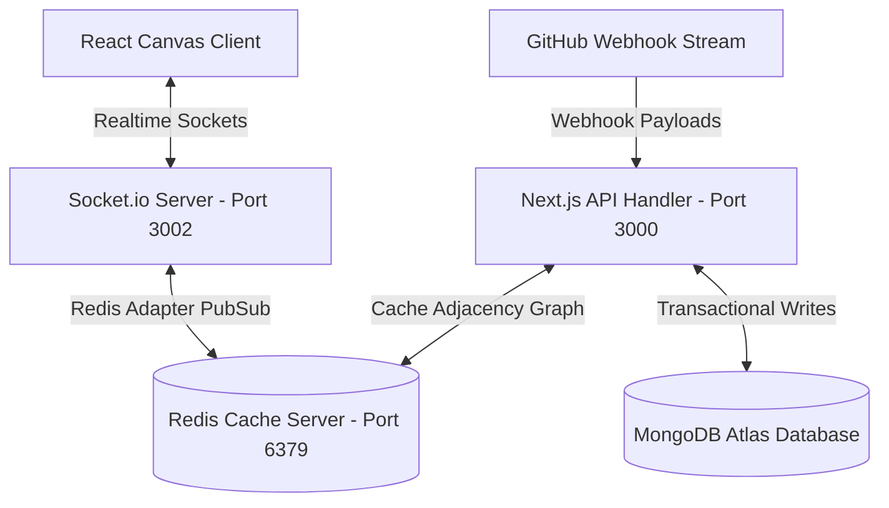

# HiveOS — The Agentic Workspace for Teams That Build

HiveOS is a collaborative workspace platform designed for developer teams. It unifies project canvas graphs, document specifications, and live GitHub webhook event streams into a single in-memory **Knowledge Graph**, constantly audited by autonomous LLM agents.

---

## System Architecture



- **Next.js Web App**: Standalone Next.js 15 build serving workspace pages, API routes, and OAuth sessions. Runs on port `3000`.
- **Realtime Presence Server**: Independent Node.js application managing workspace WebSocket rooms, activity broadcasts, and node locks. Runs on port `3002`.
- **Redis Cache Server**: Message broker and caching layer linking Next.js API mutations with Socket.io clients. Runs on port `6379`.

---

## Production Deployment with Docker Compose

We provide a production-ready composition orchestrating the Next.js web application, standalone Socket.io server, and Redis cache.

### 1. Configure Environment Variables
Create a `.env` file at the project root folder (next to `docker-compose.yml`):

```env
# Database Credentials
MONGODB_URI=mongodb+srv://<username>:<password>@cluster0.mongodb.net/hiveos?retryWrites=true&w=majority
JWT_SECRET=your_realtime_jwt_secret_here

# Authentication Config (Better Auth)
BETTER_AUTH_SECRET=your_better_auth_secret_here
BETTER_AUTH_URL=http://localhost:3000

# OAuth Client Configs (Register in GitHub Developer Settings)
GITHUB_CLIENT_ID=your_github_client_id_here
GITHUB_CLIENT_SECRET=your_github_client_secret_here

# NVIDIA NIM inference gateway
NVIDIA_NIM_API_KEY=your_nvidia_api_key_here
```

### 2. Launch Stack
Start the entire service architecture in detached daemon mode:

```bash
docker compose up --build -d
```

Verify that all three services are operational:

```bash
docker compose ps
```

- **Web App**: http://localhost:3000
- **Socket.io Server**: http://localhost:3002
- **Redis Server**: 127.0.0.1:6379

### 3. Teardown Stack
To stop and tear down all containers and networks:

```bash
docker compose down
```

---

## Local Development Guide

### Prerequisites
- **Node.js** v20+
- **MongoDB** Local instance or Atlas URI
- **Redis** Local instance running on port `6379`

### Running Development Servers

1. Install dependencies in both modules:
   ```bash
   # Install Next.js app dependencies
   cd hiveos-app
   npm install

   # Install Realtime server dependencies
   cd ../realtime-server
   npm install
   ```

2. Run Next.js development server:
   ```bash
   cd hiveos-app
   npm run dev
   ```

3. Run realtime Socket.io development server:
   ```bash
   cd realtime-server
   npm run dev
   ```

---

## Verification & Type Safety

To verify TypeScript compilation and build validity:

```bash
cd hiveos-app
npx tsc --noEmit
npm run build
```
